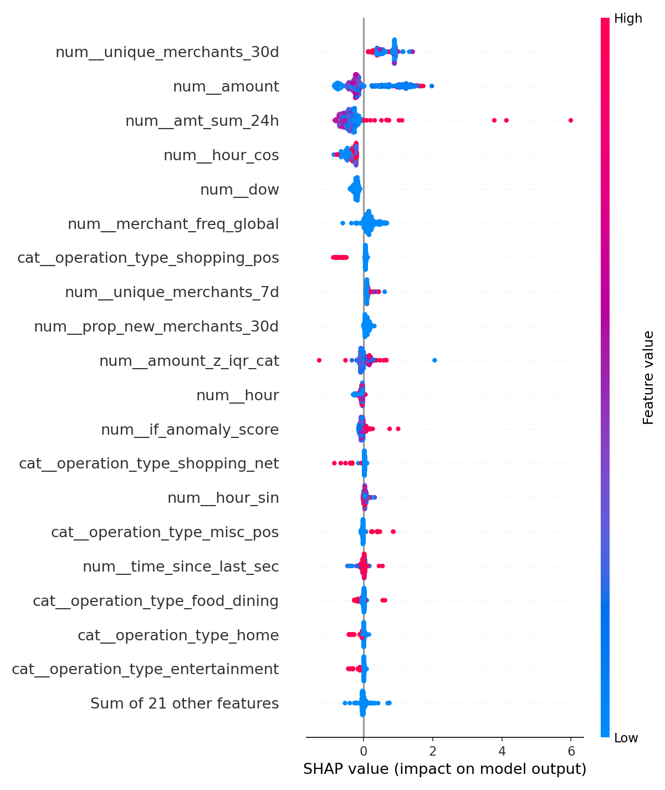
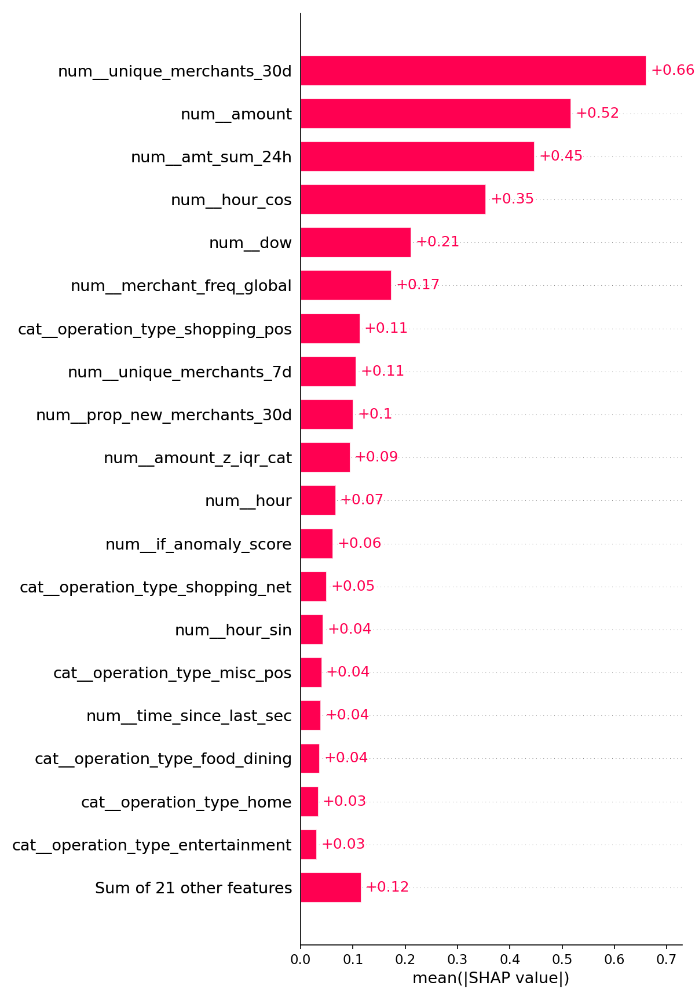

# Current Fraud Model Status Report

## Overview

- Architecture: Phase 1 (Isolation Forest + rules) for DGuard shadowing; Phase 2 (GBDT with calibration + rules + IF features) trained on public labeled datasets.
- Serving surface: `fraud-scoring-service` (FastAPI) querying MongoDB and applying per-transaction features, thresholds, and artifacts.

## Data used (training/testing)

- ULB Credit Card Fraud (Europe) — labeled, used for Phase 2 training/eval.
- IEEE-CIS Fraud Detection — labeled, joined identity+transactions for extended features; used for Phase 2 training/eval.
- PaySim — synthetic labeled mobile money; used for ETL validation only (optional in training).
- BAF (NeurIPS 2022) — labeled banking dataset variants; used for profiling and scenario testing.
- DGuard MongoDB (remote Railway proxy) — unlabeled production-like data; used for Phase 1 shadow scoring and feature validation.

## Model architecture

- Phase 1 (unsupervised + rules):
  - Feature stack: amount_core (abs/log1p), velocity (txn_count_1h/24h, time_since_last_sec), robust amount z-score per category (winsorized-IQR), novelty signals (new category/account, time since last), per-account statistics (mean/std/p50, p90/p99), cyclic hour features.
  - Isolation Forest (sklearn) trained excluding extreme high-amount rule hits to reduce contamination; anomaly score thresholding (global + per-category fallback).
  - Rules: high amount ≥ p99.5 (global or from params), extreme amount, new-merchant-high, rapid repeats; aggregated into rule_score.
- Phase 2 (supervised):
  - GBDT (scikit-learn GradientBoosting) with calibrated outputs (isotonic), stacked with IF anomaly score and rule_score as features.
  - Merchant frequency global map and category-aware thresholds; per-category thresholds at alert_frac {0.5%, 1%} exported for serving.

### Feature stack in use (current)

- Phase 1: using the recommended stack “amount_core + velocity + cat_robust (winsorized-IQR) + novelty_category + per-account stats”. This was selected after ablations as the best-performing unsupervised set at low alert budgets while remaining robust on DGuard.
- Phase 2: using the “enhanced” stack with calibrated GBDT + stacked IF anomaly score + rule_score and merchant frequency features, with per-category threshold calibration. This is the historically best-performing configuration on ULB (highest AP and P@0.5%) and was chosen over segmented variants due to slightly better overall metrics and simpler ops.

## Current metrics (latest runs)

- Phase 1 (remote DGuard snapshot, ~49 rows at time of run):
  - alerts_phase1_summary.json: total_rows=49, alerts=1, alert_rate≈2.04%, tau≈0.0868.
  - Drift log recorded under reports/phase1/drift.
- Phase 2 (ULB shadow on 1k sample):
  - shadow_alerts_summary.json: alert_frac=0.005, alerts=3; SHAP reasons available per alert.
  - SHAP (global): summary/importance plots are generated when plotting deps are available. See `reports/phase2/ulb_gbdt/shap_top_features.json` for the ranked list by mean |SHAP|. Typical top features include amount-derived stats (abs_amount, amt_sum_24h), robust z-score (amount_z_iqr_cat), velocity (txn_count_24h), and time/cycle features.

### SHAP visualizations (current model)

- Historical Phase 2 (ULB full):
  - Using the enhanced stack (current): AP≈0.92; P@0.5%≈0.83–0.84. Earlier stacks were lower; this configuration is retained as the best.

## DGuard Mongo vs training data: schema and semantics

- DGuard (Mongo):
  - Time fields: event_time may be absent; often present as operation_date/value_date; normalized to a single event_time in ETL/service.
  - operation_type: strings (varied casing); normalized to lowercase.
  - merchant fields: merchant_clean_name available; mapped to merchant_name.
  - risk fields: fraud_score/is_suspicious may exist; ignored in model training and scoring.
- ULB/IEEE training:
  - Explicit labels (is_fraud) — absent in DGuard.
  - Different event time representations: numeric timestamps (ULB unix_time; IEEE TransactionDT relative offset).
  - Category fields differ (ULB category vs DGuard operation_type).

## ETL and service bridging strategy

- Mapping to unified schema (etl_unified.py):
  - DGuard mapping: uuid→transaction_id, merchant_clean_name→merchant_name, operation_type→transaction_type, fraud_score→risk_score, is_suspicious→risk_flag, operation_date→event_time_str.
  - Excludes _id in export to Parquet/Postgres; robust type conversions; optional Postgres COPY write with schema evolution.
- Service aggregation (fraud-scoring-service):
  - event_time := toDate(event_time || operation_date || value_date)
  - operation_type_norm := lower(toString(operation_type))
  - user_id_norm := toString(user_id)
  - Window features via $setWindowFields partitioned by cc_num | account_id | user_id fallback.
  - Sort by event_time desc prior to limit; limit controlled by request options.
- Flexibility:
  - Ignores absent optional fields (e.g., fraud_score) and falls back to robust defaults (zeros/NaN-safe transforms).
  - Accepts varying types via normalization.

## Adapting to new data sources

- Add a new mapping in etl_unified.py: rename and as-is collections for source columns; ensure event_time derivation and transaction_id assignment.
- Extend service normalization if new time/categorical fields appear (e.g., map source-specific time keys in $set).
- Provide category mapping table if operation_type variants should be grouped differently.

## Anonymization and PII considerations

- Potential PII in sources:
  - DGuard: user_id, account_id, merchant names, descriptions; possible tokens/IDs in provider_data; emails in contact fields.
  - ULB/IEEE: names, addresses, device info.
- Current safeguards:
  - ETL writes TEXT to Postgres, does not persist provider tokens; _id excluded from Parquet.
  - Service avoids logging PII and does not write back to Mongo.
- Anonymization adaptation (if required):
  - Hash stable identifiers with salt (provided by get_hash_salt) at ETL ingestion (e.g., hash user_id/account_id/merchant_name into tokens), keep lookup maps off-line if re-identification needed.
  - Redact free-text descriptions/categories or tokenize to frequency buckets.
  - Replace merchant_name with categorical codes via vocabulary maps.
  - Apply k-anonymity style minimum-count thresholds before publishing aggregates.

## Limitations and risks

- Volume sensitivity for Phase 1: low-row snapshots can skew thresholds; per-category thresholds fallback to global if insufficient support.
- Domain shift between training (ULB/IEEE) and DGuard: mitigated via robust features and calibration, but final performance on DGuard requires labels or analyst feedback loops.
- PII handling must be formalized before external sharing; hashing and redaction plan ready to apply in ETL.

## Pointers

- Artifacts: reports/phase2/ulb_gbdt/{pipeline.pkl,isotonic.pkl,if_pipe.pkl,merchant_freq_map.json,gbdt_per_category_thresholds_*.json}
- SHAP: reports/phase2/ulb_gbdt/shap_top_features.json (and plots when available: shap_summary_beeswarm.png, shap_importance_bar.png)
- Phase 1 outputs: reports/phase1/alerts_phase1.csv, alerts_phase1_summary.json
- Service: fraud-scoring-service (FastAPI) using remote Mongo (Railway) with field normalization and sort/limit.

---

## Appendix: Metrics

- Average Precision (AP): area under precision-recall curve; summarizes overall ranking quality under class imbalance.
- Precision@k% (P@α): fraction of true frauds within top α% of scored transactions; we report at 0.5%, 1.0%, 5.0% to represent different alert budgets.
- Alert rate: observed fraction of transactions flagged by the current thresholding policy.
- Per-category thresholds: thresholds calibrated per operation_type to allocate alerts more evenly across categories; fall back to global or dynamic top-k when insufficient support.
- Tau (τ): anomaly-score decision threshold used in Phase 1 (Isolation Forest). Computed as the (1−alert_frac) quantile of the anomaly_score distribution (globally, or per-category when supported). Guards: if τ is non-positive/unstable on small samples, we clamp to a positive global quantile. Alerts are those with anomaly_score ≥ τ (or category-specific τ).
